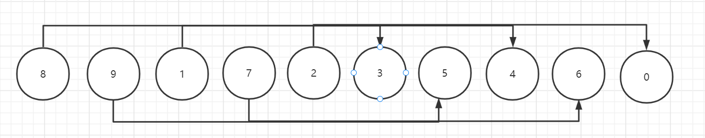
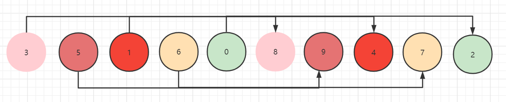
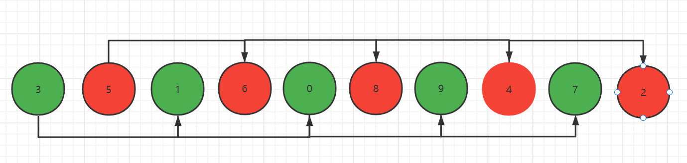
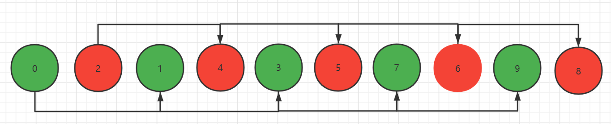
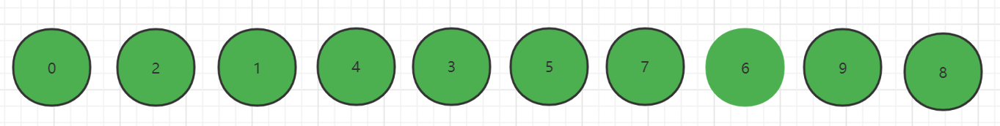

### 希尔排序

> 希尔排序是把记录按下标的一定增量分组，对每组使用直接插入排序算法排序；随着增量的逐渐减少。每组包含的关键词越来越多，当增量减至1时，整个文件
> 恰被分成一组，算法终止

* 关于希尔排序的思想举例：

一个数组中有十个待排序的数字，按照步长为5分组



比如下标为0的数据和下标为5的数据比较大小，0->5, 1->6, 2->7, 3->8, 4->9,按照从小到大的排序，小的数字交换，大的数字不动



第二次在交换后的数据再次分组，分为两组，0->2->4->6->8, 1->3->5->7->9



继续交换第二次分组之后的数据，把小数据移动在前，大数据移动在后



得到第二次移动后的数据之后再分组[整个数组就是一组数据]



对最后一组的数据做移动[从小到大排序]

* 希尔排序第一轮

```php
//希尔排序第一轮
//将数组数据分为len/2组
for ($i = 5; $i < count($arr); $i++) {
    for ($j = $i - 5; $j >=0; $j -= 5) {
        //如果当前的元素大于加上步长的元素，需要交换
        if ($arr[$j] > $arr[$j + 5]) {
            $tmp = $arr[$j];

            $arr[$j] = $arr[$j + 5];

            $arr[$j + 5] = $tmp;
        }
    }
}

echo implode('-', $arr) . PHP_EOL;
```

* 希尔排序第二轮

```php
//希尔排序第二轮
//将数组数据分为len/2组
for ($i = 2; $i < count($arr); $i++) {
    for ($j = $i - 2; $j >=0; $j -= 2) {
        //如果当前的元素大于加上步长的元素，需要交换
        if ($arr[$j] > $arr[$j + 2]) {
            $tmp = $arr[$j];

            $arr[$j] = $arr[$j + 2];

            $arr[$j + 2] = $tmp;
        }
    }
}

echo implode('-', $arr) . PHP_EOL;
```

* 希尔排序第三轮

```php
//希尔排序第三轮
//将数组数据分为len/2组
for ($i = 1; $i < count($arr); $i++) {
    for ($j = $i - 1; $j >=0; $j -= 1) {
        //如果当前的元素大于加上步长的元素，需要交换
        if ($arr[$j] > $arr[$j + 1]) {
            $tmp = $arr[$j];

            $arr[$j] = $arr[$j + 1];

            $arr[$j + 1] = $tmp;
        }
    }
}

echo implode('-', $arr) . PHP_EOL;
```

* 希尔排序可以有两种不同的方式实现数据交换 ***交换法|移动法***
  * 交换法：每次找到数据都交换位置，上面示例就是交换数据，消耗资源，时间
  * 移动法：采用之前的插入排序方式，找到数据的位置之后，直接插入进去，消耗小，速度快

* PHP实现的移动法希尔排序

```php
function shellSort2(array $arr)
{
    $len = count($arr);
    for ($gap = $len >> 1; $gap > 0; ) {
        for ($i = $gap; $i < $len; $i++) {
           $j = $i;

           $tmp = $arr[$j];

           if ($arr[$j] < $arr[$j - $gap]) {
               while ($j - $gap >= 0 && $tmp < $arr[$j - $gap]) {
                   $arr[$j] = $arr[$j - $gap];
                   $j -= $gap;
               }

               //退出循环，找到插入位置
               $arr[$j] = $tmp;
           }
        }
        echo implode("\t", $arr) . PHP_EOL;

        $gap = floor($gap / 2);
    }

    return $arr;
}
```

* 测试

```php
$arr = [8, 9, 1, 7, 2, 3, 5, 4, 6, 0];

$arr = shellSort2($arr);
echo implode("\t", $arr) . PHP_EOL;

### output
//3	5	1	6	0	8	9	4	7	2
//0	2	1	4	3	5	7	6	9	8
//0	1	2	3	4	5	6	7	8	9
//0	1	2	3	4	5	6	7	8	9
```