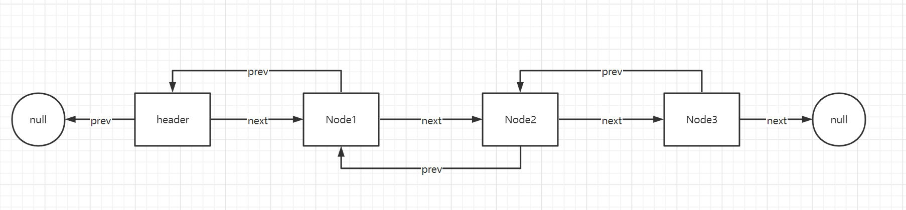
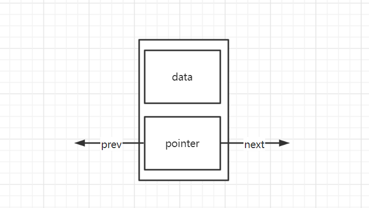
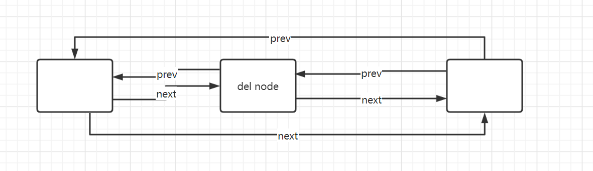

### 数据结构之关于链表[双向链表]

> 链表是一种物理存储单元上非连续、非顺序的存储结构，数据元素的逻辑顺序是通过链表中的指针链接次序实现的。链表由一系列结点（链表中每一个元素称为结点）
> 组成，结点可以在运行时动态生成。每个结点包括两个部分：一个是存储数据元素的数据域，另一个是存储下一个结点地址的指针域。 相比于线性表顺序结构，操作复杂。
> 由于不必须按顺序存储，链表在插入的时候可以达到O(1)的复杂度，比另一种线性表顺序表快得多，但是查找一个节点或者访问特定编号的节点则需要O(n)的时间，
> 而线性表和顺序表相应的时间复杂度分别是O(logn)和O(1)。



*******

* 在双向链表中，节点大概分为两个部分，数据域[存储当前节点的数据]，指针域[指向当前节点的前一个和后一个节点]



```php
class Node
{
    /**
     * @var  Node|null
     */
    public ?Node $next = null;

    /**
     * @var  Node|null
     */
    public ?Node $prev = null;

    /**
     * @var
     */
    protected $item;

    public function __construct(?Node $prev, $element, ?Node $next)
    {
        $this->item = $element;

        $this->prev = $prev;

        $this->next = $next;
    }

    public function getItem()
    {
        return $this->item;
    }
}
```

* 添加节点，可以从顺序添加在最后一个节点上，也可以直接添加在第一个节点上。[也可以添加在中间节点上]。
  * 添加在尾部：把当前链表最后一个节点的`next`指针指向新节点，把新节点的`prev`指针指向当前链表的最后一个节点，新节点的`next`指针指向空`null`
  * 添加在头部：把当前链表第一个节点的`prev`指针指向新节点，新节点的`next`指针指向当前链表的第一个节点，新节点的`prev`指针指向空`null`

```php
    /**
     * @Notes: 在尾部添加数据
     *
     * @User: Jay.Li
     * @Methods: linkLast
     * @Date: 2022/4/15
     * @param $item
     */
    private function linkLast($item):void
    {
        $l = $this->last;

        $newNode = new Node($l, $item, null);

        $this->last = $newNode;

        if ($l === null) {
            $this->first = $newNode;
        } else {
            $l->next = $newNode;
        }

        $this->size++;
    }

    /**
     * @Notes: 在头部添加数据
     *
     * @User: Jay.Li
     * @Methods: linkFirst
     * @Date: 2022/4/15
     * @param $item
     */
    private function linkFirst($item):void
    {
        $f = $this->first;

        $newNode = new Node(null, $item, $f);

        $this->first = $newNode;

        if ($f === null) {
            $this->last = $newNode;
        } else {
            $f->prev = $newNode;
        }

        $this->size++;
    }
```




* 删除节点，判断待删除节点的位置
  * 头节点删除，需要把头节点的下一个节点设为头节点，`old`头节点被丢弃
  * 尾部节点删除，把尾部节点的上一个节点设为新的尾部节点，`old`尾部节点被丢弃
  * 根据索引，删除节点

```php
 private function unLinkFirst(Node $first): mixed
    {
        $element = $first->getItem();

        $next = $first->next;

        $first->setItem(null)->next = null;

        $this->first = $next;

        if ($next === null) {
            $this->last = null;
        } else {
            $next->prev = null;
        }

        $this->size--;

        return $element;
    }

    /**
     * @Notes:
     *
     * @User: Jay.Li
     * @Methods: unLinkLast
     * @Date: 2022/4/15
     *
     * @param Node $last
     *
     * @return mixed
     */
    private function unLinkLast(Node $last): mixed
    {
        $element = $last->getItem();

        $prev = $last->prev;

        $last->setItem(null)->prev = null;

        $this->last = $prev;

        if ($prev === null) {
            $this->first = null;
        } else {
            $this->last->next = null;
        }

        $this->size--;

        return $element;
    }

    /**
     * @Notes: 删除一个节点
     *
     * @User: Jay.Li
     * @Methods: unLink
     * @Date: 2022/4/15
     * @param Node $node
     *
     * @return mixed
     */
    private function unLink(Node $node): mixed
    {
        $element = $node->getItem();

        //待删除几点的后一个节点
        $next = $node->next;

        //待删除节点的前一个节点
        $prev = $node->prev;

        //如果待删除的前一个节点为空指针,就需要把待删除的节点的下一个节点设为头节点
        if ($prev === null) {
            $this->first = $next;
        } else {
            //把待删除节点的前一个节点的next指针指向待删除节点的下一个节点
            $prev->next = $next;
            //待删除节点prev指针设为null
            $node->prev = null;
        }

        //如果待删除的节点就是最后一个节点，就需要把待删除节点的前一个节点设为最后一个节点
        if ($next === null) {
            $this->last = $prev;
        } else {
            //把待删除节点的下一个节点的prev指针指向待删除节点的前一个节点
            $next->prev = $prev;
            //同时把待删除节点的next指针只为null
            $node->next = null;
        }

        //长度减一
        $this->size--;

        //数据域设为空
        $node->setItem(null);

        return $element;
    }
```

* 关于根据索引`key`找到某一个节点的信息。这里如果直接从头开始或者从尾部开始就是有点浪费了，可以利用二分查找法，先过半，再判断索引key,在那个半边，
如果距离头部节点近就从头部开始，如果距离尾部节点近，就从尾部开始。这样效率会稍微好点

```php
protected function node(int $index): Node
{
    //关于位移的操作，右移一位是减半 10 >> 1 = 5 >> 1 = 2 >> 1 = 1 >> 1 = 0
    if ($index < ($this->size >> 1)) {
        $x = $this->first;
        for ($i = 0; $i < $index; $i++) {
            $x = $x->next;
        }
    } else {
        $x = $this->last;
        for ($i = $this->size - 1; $i > $index; $i--) {
            $x = $x->prev;
        }
    }

    return $x;
}
```