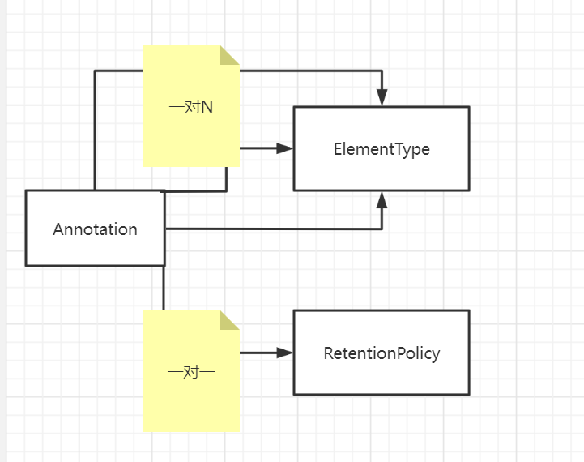

### java Annotation(注解)


#### java 原生注解(内置的注解)

1) `@Override` 检查该方法是否是重写方法。如果发现其父类，或者是引用的接口中并没有该方法时，会报编译错误
2) `@Deprecated`  标记过时方法。如果使用该方法，会报编译警告。
3) `@SuppressWarnings` 指示编译器去忽略注解中声明的警告。
4) `@Retention` 标识这个注解怎么保存，是只在代码中，还是编入class文件中，或者是在运行时可以通过反射访问
5) `@Documented` 标记这些注解是否包含在用户文档中
6) `@Target`  标记这个注解应该是哪种 Java 成员。
7) `@Inherited`  标记这个注解是继承于哪个注解类(默认 注解并没有继承于任何子类)
8) `@SafeVarargs` 忽略任何使用参数为泛型变量的方法或构造函数调用产生的警告。
9) `@FunctionalInterface` 标识一个匿名函数或函数式接口。
10) `@Repeatable` 标识某注解可以在同一个声明上使用多次


#### 关于注解中的相关问题

* ``Annotation`` 接口的关系图



1. `Annotation` 接口

```java
public interface Annotation {
    boolean equals(Object obj);
   
    int hashCode();
    
    String toString();
    
    Class<? extends Annotation> annotationType();
}
```

2. `ElementType` 枚举

```java
public enum ElementType {
    // 类，接口，注释类型，枚举的声明
    TYPE,
    //字段，枚举常量
    FIELD,
    //方法声明
    METHOD,
    //（形）参数声明
    PARAMETER,
    //构造函数声明
    CONSTRUCTOR,
    //局部变量声明
    LOCAL_VARIABLE,
    //注释类型声明
    ANNOTATION_TYPE,
    //包声明
    PACKAGE,
    //（类型）参数申明
    TYPE_PARAMETER,

    TYPE_USE
}
```

3. `RetentionPolicy` 枚举

```java
public enum RetentionPolicy {
    //Annotation信息仅存在于编译器处理期间，编译器处理完之后就没有该Annotation信息了
    SOURCE,
    //默认行为，编译器将Annotation存储于类对应的.class文件中
    CLASS,
    //编译器将Annotation存储于class文件中，并且可以由jvm读入
    RUNTIME
}
```

#### 添加自定义注解

1) 注解关键字`@interface`,
2) 添加了关键字，就代表实现了`public interface Annotation {}` 接口
3) 注解的写法示例

```java
public @interface MyAnnotation {
}
```
4) 每一个`Annotation`接口都和一个`RetentionPolicy`（的属性）关联，和n个`ElementType`（的属性）关联
5) `RetentionPolicy | ElementType` 都是枚举类型，用来修饰 `Annotation`类型
6) 在自定义注解中添加元注解,(可以添加多个)

```java
@Documented
@Target({ElementType.TYPE})
@Retention(RetentionPolicy.RUNTIME)
public @interface MyAnnotation1 {
}
```


#### 解析（反射）注解