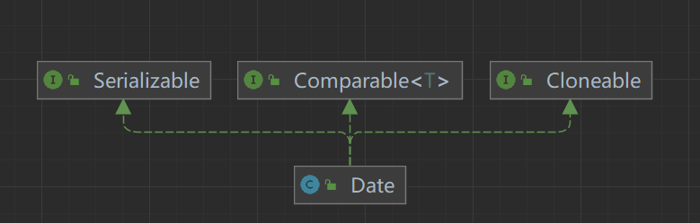
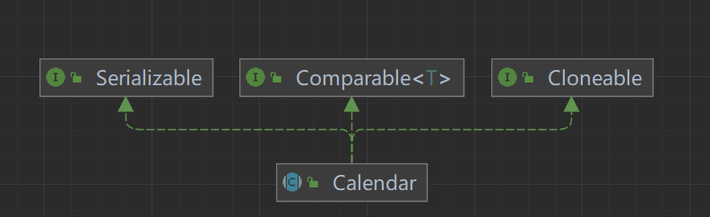
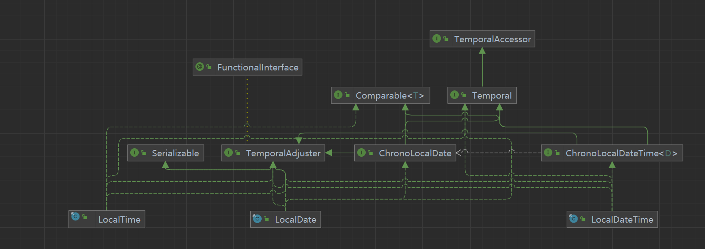

### Java关于时间的操作

**java时间相关的类**

|                 title                  |    时间线    |类图|
|:--------------------------------------:|:---------:|:----:|
|                 `date`                 |    第一代    ||
|               `Calendar`               |    第二代    ||
| `LocalDate ~ LocalTime ~LocalDateTime` |第三代||

`Date`日期格式化类`SimpleDateFormat`

