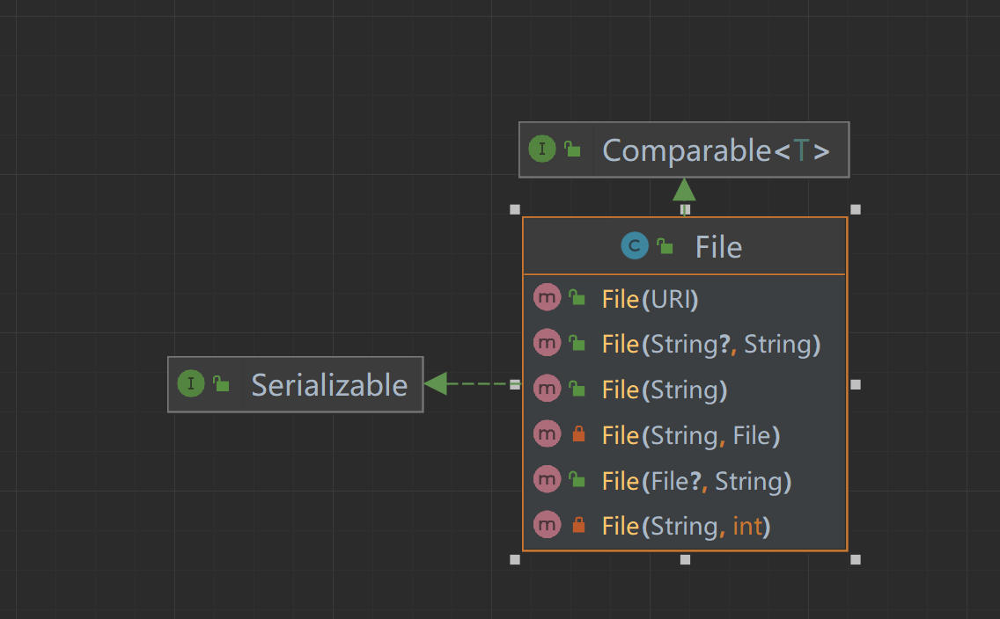
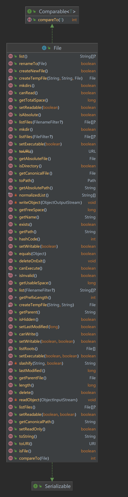
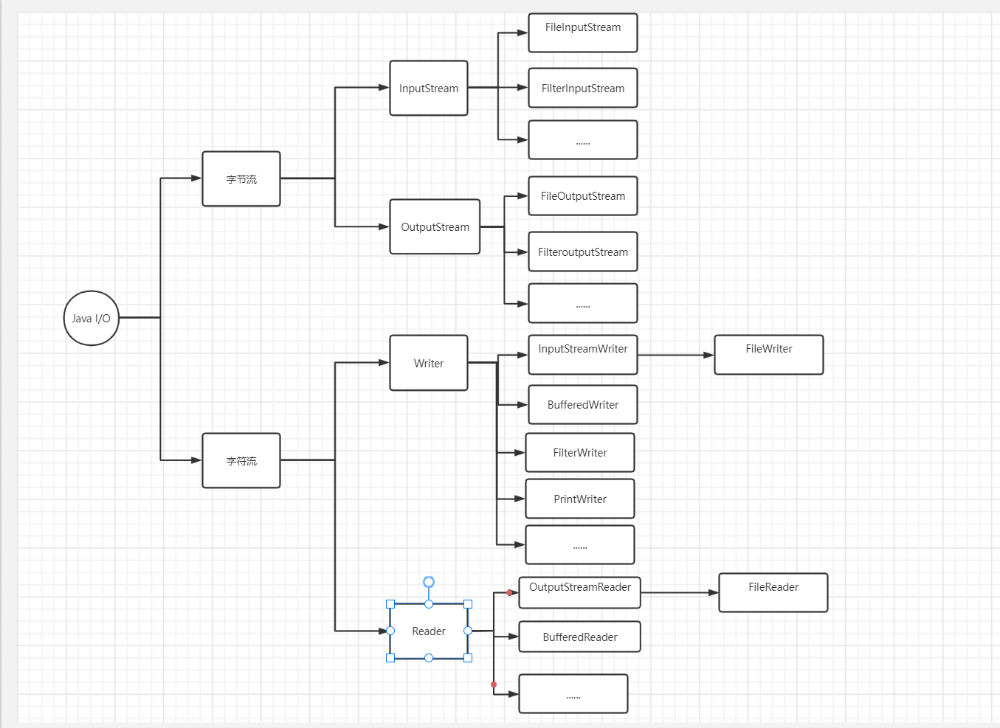

### Java IO 流操作

#### 文件流(文件在程序中是以流的形式来操作的)

* 内存 --> 磁盘 【输出流】
* 磁盘 --> 内存 【输入流】

#### 在程序中创建文件的几种方式



* 把文件路径直接传入`file`对象

```java
class TestCreateFile {
    public void test1() throws IOException {
        File file = new File("D:\\tmp\\test8.txt");

        file.createNewFile();
    }
}
```

* 先创建路径的`file`对象,把路径的`file`对象作为参数再次传入新的`file`对象

```java
class TestCreateFile {
    public void test2() throws IOException {
        File parent = new File("D:\\tmp");

        File file = new File(parent, "test9.txt");

        file.createNewFile();

    }
}
```

* 把路径和文件名分别作为参数传入`file`对象

````java
class TestCreateFile {
    public void test3() throws IOException {
        File file = new File("D:\\tmp", "test10.txt");

        file.createNewFile();
    }
}
````

#### `File`对象的一些常用方法



```java
class TestCreateFile {
    public void test4() throws IOException {
        File file = new File("D:\\tmp", "test10.txt");

        System.out.println("文件名：" + file.getName());
        System.out.println("文件绝对路径：" + file.getAbsoluteFile());
        System.out.println("文件父级目录：" + file.getParent());
        System.out.println("文件大小（字节）：" + file.length());
        System.out.println("文件是否存在：" + file.exists());
        System.out.println("是否是文件：" + file.isFile());
        System.out.println("是否是目录：" + file.isDirectory());

        final File file1 = new File("D:\\tmp");

        //得到目录下所属有的文件
        final File[] files = file1.listFiles();

        for (File file2: files) {
            System.out.println(file2.getName());
        }

        //创建单个目录
        String path1 = "D:\\tmp\\m1";

        final File file2 = new File(path1);

        file2.mkdir();

        //递归创建多级目录
        String path2 = "D:\\tmp\\m2\\m3\\m4\\m5";
        final File file3 = new File(path2);
        file3.mkdirs();
    }
}
```

#### 流（stream）的分类

* 按操作单位分类【字节流】二进制文件和【字符流】文本文件
* 按数据流的流向不同：输入流和输出流
* 按流的角色不同：节点流和处理流/包装流

| 抽象基类 |     字节流      |  字符流   |
|:----:|:------------:|:------:|
| 输入流  | InputStream  | Reader |
| 输出流  | OutputStream | Write  |




##### `FileInputStream` 字节输入流读取

```java
class FileInputStream_ {
    //读取单个字节
    public void read1() throws IOException {
        String fileName = "test1.txt";

        FileInputStream fileInputStream = new FileInputStream(path + fileName);

        int readData = 0;

        while ((readData = fileInputStream.read()) != -1) {
            System.out.println((char) readData);
        }

        fileInputStream.close();
    }
    
    //读取多个字节
    public void read2() throws IOException {
        String fileName = "test1.txt";

        FileInputStream fileInputStream = new FileInputStream(path + fileName);

        byte[] buf = new byte[10];

        int len = 0;

        while ((len = fileInputStream.read(buf)) != -1) {
            System.out.print(new String(buf, 0, len));
        }

        fileInputStream.close();
    }
}
```

##### `FileOutputStream` 字节输出流

```java
class FileOutputStream_ {
    public static String path = "D:\\tmp\\";

    public void writeFile() throws IOException {
        String fileName = "test2.txt";
        //第二个参数为true代表追加内容
        FileOutputStream fileOutputStream = new FileOutputStream(path + fileName, true);

        fileOutputStream.write('a');
        fileOutputStream.write('b');
        fileOutputStream.write('c');
        fileOutputStream.write('d');
        fileOutputStream.write('e');
        fileOutputStream.write('f');
        String str = "\nHello world~";
        fileOutputStream.write(str.getBytes(StandardCharsets.UTF_8));

        String str1 = "\n大家好呀";
        fileOutputStream.write(str1.getBytes(StandardCharsets.UTF_8));

        String str2 = "\n维护打击的合拼射箭的";
        fileOutputStream.write(str2.getBytes(StandardCharsets.UTF_8), 0, str2.length());


        fileOutputStream.close();
    }
}
```

##### `FileReader` 字符输入流

```java
class FileReader_ {
    //读取单个字符
    public static String path = "D:\\tmp\\test3.txt";

    public void test1() throws IOException {
        FileReader fileReader = new FileReader(path);

        int data = 0;
        while ((data = fileReader.read()) != -1) {

            System.out.println((char)data);

        }

        fileReader.close();
    }
    
    //读取一行字符
    public void test2() throws IOException {
        FileReader fileReader = new FileReader(path);

        int readLen = 0;
        char[] buf = new char[10];
        while ((readLen = fileReader.read(buf)) != -1) {

            System.out.print(new String(buf, 0, readLen));

        }

        fileReader.close();
    }
}
```

##### `FileWriter_` 字符输出流

```java
class FileWriter_ {
    public static String path = "D:\\tmp\\test4.txt";

    public void test1() throws IOException {
        FileWriter fileWriter = new FileWriter(path);

        fileWriter.write('A');
        fileWriter.write('B');
        fileWriter.write('c');

        char[] chars = {'a', 'b', 'c', 'd'};

        fileWriter.write(chars);

        fileWriter.write(100);

        fileWriter.write("打击好啊~what 你 you 1", 3, 5);

        fileWriter.write("风雨过后，见到了彩虹~");

        fileWriter.write("\njava是什么呀~是编程的~是什么编程".toCharArray(), 0, 8);

//        fileWriter.flush();

        fileWriter.close();
    }
}
```

##### 节点流可以从一个特定的数据源读写数据，如`FileReader | FileWriter`
##### 处理流（包装流）是连接在已存在的流（节点流或处理流）之上，为程序提供更为强大（灵活）的读写功能。如`BufferedReader|BufferedWrirer`

| 分类    |        节点输入流         |         节点输出流         |       字符输入流       |       字符输出流        |
|:------|:--------------------:|:---------------------:|:-----------------:|:------------------:|
| 抽象基类  |     InputStream      |     OutputStream      |      Reader       |       Writer       |
| 访问文件  |   FileInputStream    |   FileOutputStream    |    FileReader     |     FileWriter     |
| 访问数组  | ByteArrayInputStream | ByteArrayOutputStream |  CharArrayReader  |  CharArrayWriter   |
| 访问管道  |   PipedInputStream   |   PipedOutputStream   |    PipedReader    |    PipedWriter     |
| 访问字符串 |          --          |          --           |   StringReader    |    StringWriter    |
| 缓冲流   | BufferedInputStream  | BufferedOutputStream  |  BufferedReader   |   BufferedWriter   |
| 转换流   |          --          |          --           | InputStreamReader | OutputStreamWriter |
| 对象流   |  ObjectInputStream   |  ObjectOutputStream   |        --         |         --         |
| 抽象基类  |  FilterInputStream   |  FilterOutputStream   |   FilterReader    |    FilterWriter    |
| 打印流   |          --          |      PrintStream      |        --         |    PrintWriter     |
| 推回输入流 | PushbackInputStream  |          --           |  PushbackReader   |        ---         |
| 特殊流   |   DataInputStream    |   DataOutputStream    |        --         |         --         |


##### 处理流【包装流】`BufferedReader|BufferedWriter`字符操作 `BufferedInputStream|BufferedOutputStream`字节操作

```java
class BufferedReaderAndWriter {
    String path = "D:\\tmp\\test.txt";

    public void reader() throws IOException {

        BufferedReader bufferedReader = new BufferedReader(new FileReader(path));

        String line;

        while ((line = bufferedReader.readLine()) != null) {
            System.out.println(line);
        }

        bufferedReader.close();
    }

    public void writer() throws IOException {
        BufferedWriter bufferedWriter = new BufferedWriter(new FileWriter(path));

        bufferedWriter.write(new char[]{1, 'A', 'a'});

        bufferedWriter.newLine();
        for (int i = 0; i < 1000; i++) {
            bufferedWriter.write(i);
            bufferedWriter.newLine();

        }

        bufferedWriter.close();
    }
}
```

#### 对象流 ``ObjectInputStream``，提供了对基本类型或对象类型的序列化和反序列化的方法

```java
class ObjectInputStream_ {
    public String path = "D:\\tmp\\test5.txt";

    public void test1() throws IOException {
        ObjectOutputStream objectOutputStream = new ObjectOutputStream(new FileOutputStream(path));

        for (int i = 1; i <= 10; i++) {
            objectOutputStream.writeInt(i);
        }

        objectOutputStream.writeBoolean(true);

        objectOutputStream.writeChar('A');

        objectOutputStream.writeDouble(1.101);

        objectOutputStream.writeUTF("大家号");

        objectOutputStream.writeObject(new Dog("tom", 12));

        objectOutputStream.close();

        System.out.println("数据保存完毕~序列化形式~");
    }
}

class Dog implements Serializable {
    private String name;

    private int age;

    public Dog(String name, int age) {
        this.name = name;
        this.age = age;
    }
}
```

#### 标准输入输出流 ``System.in | System.out``

> 键盘输入【System.in】默认的控制台输出 【System.out】

#### 转换流 ``InputStreamReader | OutputStreamWriter``

```java
public class InputStreamReader_ {

    String path = "D:\\tmp\\test6.txt";

    public void test1() throws IOException {
        InputStreamReader gbk = new InputStreamReader(new FileInputStream(path), "GBK");

        BufferedReader bufferedReader = new BufferedReader(gbk);
        String s = bufferedReader.readLine();

        System.out.println(s);

        bufferedReader.close();
    }

    public void test2() throws IOException {
        OutputStreamWriter gbk = new OutputStreamWriter(new FileOutputStream("D:\\tmp\\test7.txt"), "utf8");

        gbk.write("大记号的~");

        gbk.close();


    }
}
```

#### 打印流 `PrintStream | PrintWriter`

```java
public class PrintStream_ {

    public void test1() throws IOException {
        PrintStream printStream = System.out;

        printStream.print("标准输出~");

        printStream.write("write".getBytes());

        printStream.close();
    }

    public void test2() {
        PrintWriter printWriter = new PrintWriter(System.out);

        printWriter.print("hi 北京你好~");

        printWriter.close();
    }

    public void test3() throws IOException {
        PrintWriter printWriter = new PrintWriter(new FileWriter("D:\\tmp\\test7.txt"));

        printWriter.print("hi 北进~");

        printWriter.close();
    }
}
```

#### 读取写入`.properties`文件

```java
public class Properties_ {

    public void test1() throws IOException {

        Properties properties = new Properties();

        properties.load(new FileInputStream("src\\test.properties"));

        properties.list(System.out);

        System.out.println(properties.getProperty("ip"));
        System.out.println(properties.getProperty("num"));
    }

    public void test2() throws IOException {
        Properties properties = new Properties();

        properties.setProperty("charset", "UTF8");
        properties.setProperty("host", "127.0.0.1");
        properties.setProperty("port", "3306");
        properties.setProperty("user", "root");
        properties.setProperty("password", "root");
        properties.setProperty("name", "中国");

        properties.store(new FileOutputStream("src\\test2.properties"), "添加注释~");

        System.out.println("配置文件保存成功~");
    }
}
```
