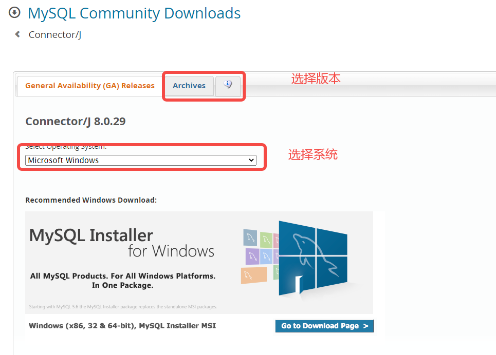
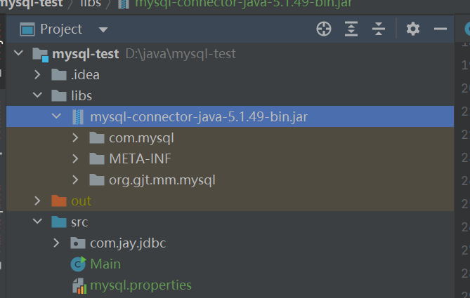
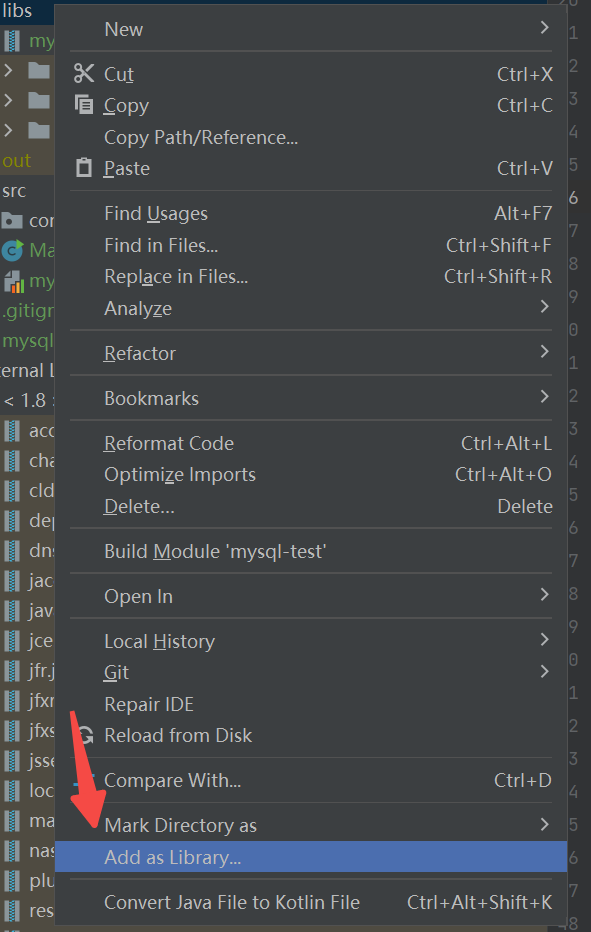

### java 连接 mysql

1. 下载mysql驱动文件 [https://dev.mysql.com/downloads/connector/j/](https://dev.mysql.com/downloads/connector/j/)



2. 新创建一个Java项目，在项目目录下新建文件`libs`,把下载好的驱动文件丢入`libs`目录下



3. 在`idea`中导入这个驱动，选择在驱动包，右键`add as lib..`



4. 多种方法连接到MySQL

**第一种** 直接`new`创建对象的形式

```java
class Db {
    public static void connect01() throws SQLException {
        Driver driver = new Driver();

        String url = "jdbc:mysql://localhost:3306/test_blog?useSSL=false";

        Properties properties = new Properties();

        properties.setProperty("user", "root");
        properties.setProperty("password", "root");

        Connection connect = driver.connect(url, properties);

        System.out.println(connect);

    }
}
```

**第二种** 利用反射

```java
class Db {
    public static void connect02() throws ClassNotFoundException, InstantiationException, IllegalAccessException, SQLException {
        Class<?> aClass = Class.forName("com.mysql.jdbc.Driver");

        Driver driver = (Driver)aClass.newInstance();

        String url = "jdbc:mysql://localhost:3306/test_blog?useSSL=false";

        Properties properties = new Properties();

        properties.setProperty("user", "root");
        properties.setProperty("password", "root");

        Connection connect = driver.connect(url, properties);

        System.out.println(connect);
    }
}
```

**第三种** 利用反射

```java
class Db {
    public static void connect03() throws ClassNotFoundException, InstantiationException, IllegalAccessException, SQLException {
        Class<?> aClass = Class.forName("com.mysql.jdbc.Driver");
        Driver driver = (Driver)aClass.newInstance();

        String url = "jdbc:mysql://localhost:3306/test_blog?useSSL=false";
        String user = "root";
        String password = "root";

        DriverManager.registerDriver(driver);

        Connection connection = DriverManager.getConnection(url, user, password);

        System.out.println(connection);
    }
}
```

**第四种** 利用反射

```java
class Db {
    public static void connect04() throws ClassNotFoundException, SQLException {
        Class.forName("com.mysql.jdbc.Driver");

        String url = "jdbc:mysql://localhost:3306/test_blog?useSSL=false";
        String user = "root";
        String password = "root";

        Connection connection = DriverManager.getConnection(url, user, password);

        System.out.println(connection);
    }
}
```

**第五种** 利用反射和读取配置文件

```java
class Db {
    public static void connect05() throws IOException, ClassNotFoundException, SQLException {
        //Properties
        Properties properties = new Properties();

        properties.load(new FileInputStream("src\\mysql.properties"));

        String user = properties.getProperty("user");
        String password = properties.getProperty("password");
        String url = properties.getProperty("url");
        String driver = properties.getProperty("driver");

        Class.forName(driver);

        Connection connection = DriverManager.getConnection(url, user, password);

        System.out.println(connection);
    }
}
```
