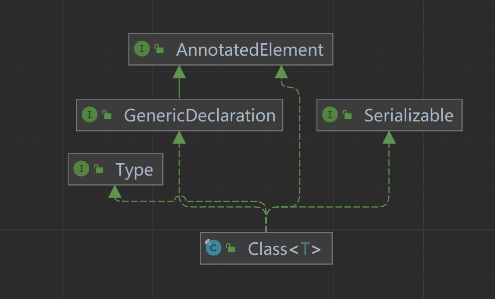
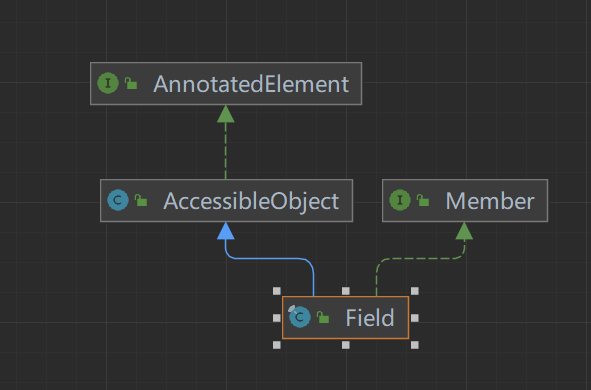

### Java 反射


##### `Calss cls = Class.forName("com.jay.Cat")` 通过反射得到一个类



* 运行类型

```
final Class<? extends Class> aClass = cls.getClass();

System.out.println(aClass);
```

* 包名

```
String packageName = cls.getPackage().getName();

System.out.println(packageName);
```

* 全类名

```
String className = cls.getName();

System.out.println(className);
```

* 得到具体的对象示例

```
Object o = cls.newInstance();
```

* 得到类属性



```
Field[] fields = cls.getFields();
for (int i = 0; i < fields.length; i++) {
    System.out.println(fields[i].getName())
    System.out.println(fields[i].get(o));
}
```

* 得到类方法 


```
Method[] methods = cls.getMethods()

//类具体的方法
Method method = cls.getMethod("method name");
```

* 得到类构造方法 


```
Constructor[] constructors = cls.getConstructors();
```

##### 获取Class对象的几种方式

```java
public class GetClass_ {
    public static void main(String[] args) throws ClassNotFoundException {

        //Class.forName
        Class cls1 = Class.forName("com.jay.Cat");

        System.out.println(cls1);

        //类名.Class
        Class<Cat> cls2 = Cat.class;

        System.out.println(cls2);

        //对象示例.getClass()

        Cat cat = new Cat();

        Class<? extends Cat> cls3 = cat.getClass();

        System.out.println(cls3);

        //类加载器获取
        ClassLoader classLoader = cat.getClass().getClassLoader();
        Class<?> cls4 = classLoader.loadClass("com.jay.Cat");
        System.out.println(cls4);

        //基本数据类型
        final Class<Integer> integerClass = int.class;
        final Class<Character> characterClass = char.class;
        final Class<Boolean> booleanClass = boolean.class;

        //基本数据类型对应的包装类 Boolean double long byte
        final Class<Integer> type = Integer.TYPE;
        System.out.println(type);
        final Class<Character> type1 = Character.TYPE;
        System.out.println(type1);
    }
}

```