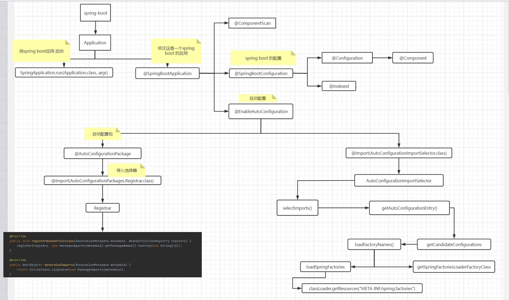

### spring-boot自动配置



spring-boot中所有的需要加载的自动配置文件位置

```java
org\springframework\boot\spring-boot-autoconfigure\2.5.1\spring-boot-autoconfigure-2.5.1.jar!\META-INF\spring.factories
public static final String FACTORIES_RESOURCE_LOCATION = "META-INF/spring.factories";
Enumeration<URL> urls = classLoader.getResources(FACTORIES_RESOURCE_LOCATION);
```

加载配置文件格式是：`****AutoConfiguration`

```java
@Configuration(proxyBeanMethods = false) // 是一个组件
@EnableConfigurationProperties(ServerProperties.class) // 对应的配置文件
@ConditionalOnWebApplication(type = ConditionalOnWebApplication.Type.SERVLET) // 必须是一个web应用类型是原生的SERVLET才配置
@ConditionalOnClass(CharacterEncodingFilter.class) //判断有这个类CharacterEncodingFilter才配置
@ConditionalOnProperty(prefix = "server.servlet.encoding", value = "enabled", matchIfMissing = true)// 判断yml配置中有这个配置为enabled，或者是没有配置也默认配置了
// 上面这些都生效了才自动配置 HttpEncodingAutoConfiguration
public class HttpEncodingAutoConfiguration {
    
}
```


每一个配置类都一个 `****Properties`配置属性类
```java
// 加载 application.yml配置文件中 server下的配置
@ConfigurationProperties(prefix = "server", ignoreUnknownFields = true)
public class ServerProperties {
    
}
```


-------

##### 注解

* 表示这是一个请求处理类 ``@Controller``

```java
@Controller
class Test {
    
}
```

* 表示一个处理类不需要模板解析 `@RestController`，返回结果直接写入`HTTP Response Body`
```java
@RestController
class Test {
    
}
```

* `@ResponseBody` 表示一个方法不需要模板解析，返回结果直接写入`HTTP Response Body`

```java
class Test {
    @RequestMapping(path = "/test", method = RequestMethod.GET)
    @ResponseBody
    public void test() {

    }
}
```

* 请求类注解,路径映射

1. ``@RequestMapping`` RestFul风格的路径,它可以是各种请求方法的综合体

```java
@RequestMapping("/http")
public class HttpController{
    // uri是 /http/test 请求方法是 GET
    @RequestMapping(path = "/test", method = RequestMethod.GET)
    public void test() {

    }
}
```

2. **GET** `@GetMapping`

```java
class Test{
    @GetMapping("/get-data")
    @ResponseBody
    public Map<String, Object> getData() {

        HashMap<String, Object> map = new HashMap<>();

        map.put("get", "data");

        return map;
    }
}
```

3. **POST** `@PostMapping`


```java
class Test{
    @PostMapping("/post-data")
    @ResponseBody
    public Map<String, Object> postData() {

        HashMap<String, Object> map = new HashMap<>();
        map.put("post", "data");
        return map;
    }
}
```

4. **PUT** `@PutMapping`


```java
class Test{
    @PutMapping("/put-data")
    @ResponseBody
    public Map<String, Object> putData() {

        HashMap<String, Object> map = new HashMap<>();
        map.put("put", "data");
        return map;
    }
}
```

5. **DELETE** `@DeleteMapping`


```java
class Test{
    @DeleteMapping("/delete-data")
    @ResponseBody
    public Map<String, Object> deleteData() {

        HashMap<String, Object> map = new HashMap<>();
        map.put("delete", "data");
        return map;
    }
}
```

6. **PATCH** `@PatchMapping`


```java
class Test{
    @PatchMapping("/patch-data")
    @ResponseBody
    public Map<String, Object> optionsData() {

        HashMap<String, Object> map = new HashMap<>();
        map.put("patch", "data");
        return map;
    }
}
```

7. ...

* 解析uri中参数`@PathVariable | /index/{abc}/tag/{name}`

```java
class Test {    
    @GetMapping("/path/{abc}/tag/{name}")
    @ResponseBody
    // @PathVariable Map<String, String>  all 不指定具体的值，拿到的是全部的数据
    public Map<String, Object> getPathVariable(@PathVariable("abc") String abc, @PathVariable("name") String name, @PathVariable Map<String, String>  all) {

        HashMap<String, Object> map = new HashMap<>();

        map.put("abc", abc);
        map.put("name", name);
        map.put("all", all);

        return map;
    }
}
```

* 解析url中请求参数`@PathParam == @RequestParam | path?name=jay&age=12`

```java
class Test {
    // /path?name=jay&age=12
    @GetMapping("/path")
    @ResponseBody
    public Map<String, Object> getPathParam(@PathParam("name") String name, @PathParam("age") String age) {

        HashMap<String, Object> map = new HashMap<>();

        map.put("age", age);
        map.put("name", name);

        return map;
    }

    // /path-request-param?name=jay&age=12
    @GetMapping("/path-request-param")
    @ResponseBody
    // @RequestParam Map<String, String> all 不指定具体的参数，给定一个map。可以得到全部的参数
    public Map<String, Object> getRequestParam(@RequestParam("name") String name, @RequestParam("age") String age, @RequestParam Map<String, String> all) {

        HashMap<String, Object> map = new HashMap<>();

        map.put("age", age);
        map.put("name", name);
        map.put("all", all);

        return map;
    }
}
```

* 解析请求头中的信息 `@RequestHeader` 可以是指定单个信息，也可以传递map拿到全部的信息

```java
class Test {
    @GetMapping("/header")
    @ResponseBody
    public Map<String, Object> getHeader(@RequestHeader("User-Agent") String userAgent, @RequestHeader Map<String, String> all) {

        HashMap<String, Object> map = new HashMap<>();

        map.put("userAgent", userAgent);
        map.put("all", all);

        return map;
    }
}
```

* 得到请求体中cookie信息`@CookieValue`

```java
class Test {
    @GetMapping("/cookie")
    @ResponseBody
    // 第一种直接指定cookie中为字符形式的名字，
    // 第二种传递一个cookie对象得到 avax.servlet.http.Cookie
    public Map<String, Object> getCookie(@CookieValue("_ga") String ga, @CookieValue("_ga") Cookie cookie) {

        HashMap<String, Object> map = new HashMap<>();

        map.put("_ga", ga);
        map.put("cookie", cookie.getName() + " == " + cookie.getValue());

        return map;
    }
}
```

* 请求体中body信息获取`@RequestBody`

```java
class Test {
    @PostMapping("/post-request-body")
    @ResponseBody
    // 如果传递过来的body是以json格式的数据，可以@RequestBody UserDto userDto使用，如果是普通的表单提交，可以直接传递一个实体类或者map
    public Map<String, Object> postData(@RequestBody String content, UserDto userDto) {
        HashMap<String, Object> map = new HashMap<>();
        map.put("post", "data");
        map.put("content", content);
        map.put("userDto", userDto);
        return map;
    }

    @PostMapping("/post-request-file")
    @ResponseBody
    // org.springframework.web.multipart.MultipartFile
    // 单文件 @RequestParam("img") MultipartFile file 文件上传
    // 多文件 @RequestParam("img") MultipartFile[] files
    public Map<String, Object> postDataFile(@RequestParam("img") MultipartFile file) {
        HashMap<String, Object> map = new HashMap<>();
        map.put("post", "data");
        map.put("file.name", file.getName());
        map.put("file.OriginalFilename", file.getOriginalFilename());
        map.put("file.size", file.getSize());
        map.put("file.type", file.getContentType());
        return map;
    }
}
```

* 组件扫描注解 ``@ComponentScan | org.springframework.context.annotation.ComponentScan``

```java
@ComponentScan(excludeFilters = { @Filter(type = FilterType.CUSTOM, classes = TypeExcludeFilter.class),
		@Filter(type = FilterType.CUSTOM, classes = AutoConfigurationExcludeFilter.class) })
public @interface SpringBootApplication {}
```

* 自动配置注解`@EnableAutoConfiguration | org.springframework.boot.autoconfigure.EnableAutoConfiguration`

* 配置bean注解`@Configuration | org.springframework.context.annotation.Configuration`

```java
@Configuration
public class MyConfig {
}
```

* 配合`@Configuration`使用`@Bean`,把组件放入spring容器

```java
@Configuration
public class MyConfig {

    @Bean
    public UserDto userDto() {
         UserDto test = new UserDto("test", 18, "test@qq.com");

         return test;
    }
}
```

* 注册到容器中的`bean`使用`@Autowired | @Qualifier`自动注入

```java
class Test {
    
    @Autowired // byType 形式的注入
    @Qualifier("user") // byName 形式注入
    UserDto userDto;
}
```

* 自动加载配置类 ``@EnableConfigurationProperties(xxx.class)``,从配置文件装配数据到类中`@ConfigurationProperties(prefix = "abc")`

```java
@EnableConfigurationProperties(TestConfig.class)
@Configuration
class Test {
    TestConfig testConfig;

    Test(TestConfig testConfig) {
        this.testConfig = testConfig;
    }
}

@ConfigurationProperties(prefix = "abc")
// lombok.Data 自动添加get set 方法
@Data
class TestConfig {
    private String name;
    private Integer age;
    private String email;
}
```

配置文件

```yaml
abc:
  name: jay
  age: 18
  email: test@qq.com
```

* `@Component`：泛指组件，当组件不好归类的时候，我们可以使用这个注解进行标注。

* `@Service`：一般用于修饰service层的组件

* `@Import` 导入其它配置类

* `@ImportResource` 加载其它xml文件

* `@ConditionalOn***` 基于条件判断是否加载某个配置

* `@FunctionalInterface` 函数式接口 
