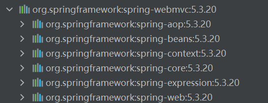

### spring框架学习一

**Spring官方地址:** [spring](https://spring.io/)

> 官方文档永远是最好的学习资料之一 [spring-docs](https://docs.spring.io/spring-framework/docs/current/reference/html/index.html)

* 在`maven`仓库中搜索`spring`,找到`spring-webmvc`,这个项目中spring的核心包几乎都有,不用单独的安装别的依赖包



* 按照配置文件把类托管到`spring | ioc` 容器中

> **IOC**全称是Inversion of Control，控制反转。它是一种设计思想，由容器将设计好的对象交给容器控制，而非对象内部直接new。
> **DI**—Dependency Injection，即“依赖注入”：组件之间依赖关系由容器在运行期决定，形象的说，即由容器动态的将某个依赖关系注入到组件之中。依赖注入的目的
> 并非为软件系统带来更多功能，而是为了提升组件重用的频率，并为系统搭建一个灵活、可扩展的平台

- **浅显：** spring 框架中，对象的托管都是在spring容器中，怎么把对象丢入容器就有大概的两种方式，**xml**配置文件和注解

- xml配置文件,这种托管定制化比较高，面对复杂的依赖注入都是比较好操作

```xml
<?xml version="1.0" encoding="UTF-8"?>
<beans xmlns="http://www.springframework.org/schema/beans"
    xmlns:xsi="http://www.w3.org/2001/XMLSchema-instance"
    xsi:schemaLocation="http://www.springframework.org/schema/beans https://www.springframework.org/schema/beans/spring-beans.xsd">

</beans>
```

- 简单的配置一个没有依赖的类到容器中

```xml
<!--id="hello" 给调用者使用查找的名字-->
<!--class="org.jay.pojo.Hello" 需要放入容器中类的具体所在-->
<!--作用域scope="singleton" 单例 scope="prototype" 原型 每次都创建不同的对象-->
<!--name="hello3" 起别名-->
<bean id="hello" class="org.jay.pojo.Hello" scope="singleton" name="hello3"></bean>
```

- 给已经在容器中的类起别名

```xml
<bean id="hello" class="org.jay.pojo.Hello"></bean>

<alias name="hello" alias="hello2"></alias>
```

- 把所有的配置文件整合到一个文件中

```xml
<import resource="1.xml"></import>
<import resource="2.xml"></import>
<import resource="3.xml"></import>
```

- 给某一个配置bean添加描述文本

```xml
<bean id="hello" class="org.jay.pojo.Hello">
    <description>这个是hello</description>
</bean>
```

##### 为有参数的类添加依赖注入`set`注入和`constructor`注入

* **SET**注入

```java
public class Student {

    // 字符串
    private String name;

    // 对象
    private User user;

    // 字符串数组
    private String[] books;

    // 链表
    private List<String> hobby;

    // map
    private Map<String, String> card;

    // 集合
    private Set<String> games;

    // 空 null
    private String wife;

    // Properties
    private Properties info;

    public String getName() {
        return name;
    }

    public void setName(String name) {
        this.name = name;
    }

    public User getUser() {
        return user;
    }

    public void setUser(User user) {
        this.user = user;
    }

    public String[] getBooks() {
        return books;
    }

    public void setBooks(String[] books) {
        this.books = books;
    }

    public List<String> getHobby() {
        return hobby;
    }

    public void setHobby(List<String> hobby) {
        this.hobby = hobby;
    }

    public Map<String, String> getCard() {
        return card;
    }

    public void setCard(Map<String, String> card) {
        this.card = card;
    }

    public Set<String> getGames() {
        return games;
    }

    public void setGames(Set<String> games) {
        this.games = games;
    }

    public String getWife() {
        return wife;
    }

    public void setWife(String wife) {
        this.wife = wife;
    }

    public Properties getInfo() {
        return info;
    }

    public void setInfo(Properties info) {
        this.info = info;
    }

    @Override
    public String toString() {
        return "Student{" +
                "name='" + name + '\'' +
                ", user=" + user +
                ", books=" + Arrays.toString(books) +
                ", hobby=" + hobby +
                ", card=" + card +
                ", games=" + games +
                ", wife='" + wife + '\'' +
                ", info=" + info +
                '}';
    }
}

```

1. 普通类型

```xml
<bean id="student" class="org.jay.pojo.Student">
    <property name="name" value="jay"></property>
</bean>
```

2. 对象

```xml
<bean id="user" class="org.jay.pojo.User"></bean>
<bean id="student" class="org.jay.pojo.Student">
    <property name="user" ref="user"></property>
</bean>
```

3. 数组

```xml
<bean id="student" class="org.jay.pojo.Student">
    <property name="books">
        <array>
            <value>西游记</value>
            <value>水浒传</value>
            <value>三国演义</value>
            <value>红楼梦</value>
        </array>
    </property>
</bean>
```

4. 链表 list

```xml
<bean id="student" class="org.jay.pojo.Student">
    <property name="hobby">
        <list>
            <value>听歌</value>
            <value>看电音</value>
            <value>打游击</value>
        </list>
    </property>
</bean>
```

5. map

```xml
<bean id="student" class="org.jay.pojo.Student">
    <property name="card">
        <map>
            <entry key="学生证" value="1223" />
            <entry key="教师证" value="3344" />
            <entry key="电话卡" value="56667" />
        </map>
    </property>
</bean>
```

6. 集合 set

```xml
<bean id="student" class="org.jay.pojo.Student">
    <property name="games">
        <set>
            <value>LOL</value>
            <value>COC</value>
            <value>BOB</value>
            <value>王者</value>
        </set>
    </property>
</bean>
```

7. 空 null

```xml
<bean id="student" class="org.jay.pojo.Student">
    <property name="wife">
        <null/>
    </property>
</bean>
```

8. Properties

```xml
<bean id="student" class="org.jay.pojo.Student">
    <property name="info">
        <props>
            <prop key="学号">201409081209</prop>
            <prop key="饭卡">234553</prop>
            <prop key="出入证">455676f</prop>
        </props>
    </property>
</bean>
```

* **constructor**注入

```java
public class User {

    private int id;

    private String title;

    public User(int id, String title) {
        this.id = id;
        this.title = title;
    }

    public int getId() {
        return id;
    }

    public void setId(int id) {
        this.id = id;
    }

    public String getTitle() {
        return title;
    }

    public void setTitle(String title) {
        this.title = title;
    }

    public void show() {
        System.out.printf("id = %d title = %s\n", id, title);
    }

    @Override
    public String toString() {
        return "User{" +
                "id=" + id +
                ", title='" + title + '\'' +
                '}';
    }
}
```

1. 通过下标

```xml
<!--下标创建-->
<bean id="user" class="org.jay.pojo.User">
    <constructor-arg index="0" value="1"/>
    <constructor-arg index="1" value="jay"/>
</bean>
```

2. 通过类型

```xml
<!--通过类型创建-->
<bean id="user" class="org.jay.pojo.User">
    <constructor-arg type="int" value="1"/>
    <constructor-arg type="java.lang.String" value="jay"/>
</bean>
```

3. 通过参数名

```xml
<!--通过参数名创建-->
<bean id="user" class="org.jay.pojo.User" scope="prototype">
    <constructor-arg name="id" value="1"/>
    <constructor-arg name="title" value="jay"/>
</bean>
```

* `p-namespace` p命名空间形式,`xmlns:p="http://www.springframework.org/schema/p"`

```xml
<beans xmlns="http://www.springframework.org/schema/beans"
    xmlns:xsi="http://www.w3.org/2001/XMLSchema-instance"
    xmlns:p="http://www.springframework.org/schema/p"
    xsi:schemaLocation="http://www.springframework.org/schema/beans
        https://www.springframework.org/schema/beans/spring-beans.xsd">
</beans>
```

```java
package org.jay.pojo;

public class Teacher {
    private String title;

    private String email;

    private int id;

    public String getTitle() {
        return title;
    }

    public void setTitle(String title) {
        this.title = title;
    }

    public String getEmail() {
        return email;
    }

    public void setEmail(String email) {
        this.email = email;
    }

    public int getId() {
        return id;
    }

    public void setId(int id) {
        this.id = id;
    }

    @Override
    public String toString() {
        return "Teacher{" +
                "title='" + title + '\'' +
                ", email='" + email + '\'' +
                ", id=" + id +
                '}';
    }
}

```

```xml
<bean id="teacher" class="org.jay.pojo.Teacher" p:title="邮件" p:email="1539853340@qq.com" p:id="19"></bean>
```


* `c-namespace` c命名空间形式,`xmlns:c="http://www.springframework.org/schema/c"`

```xml
<beans xmlns="http://www.springframework.org/schema/beans"
    xmlns:xsi="http://www.w3.org/2001/XMLSchema-instance"
    xmlns:c="http://www.springframework.org/schema/c"
    xsi:schemaLocation="http://www.springframework.org/schema/beans
        https://www.springframework.org/schema/beans/spring-beans.xsd">

    <bean id="teacher" class="org.jay.pojo.Teacher" c:email="1539853340@qq.com" c:title="邮件" c:id="22"></bean>
</beans>
```

#### bean自动装配

```java
interface Animal {
    public void call();
}

class Dog implements Animal {
    public void call() {
        System.out.println("狗汪汪汪");
    }
}

class Cat implements Animal {
    public void call() {
        System.out.println("猫喵喵喵");
    }
}

class People {
    private Cat cat;
    private Dog dog;
    private String name;

    public void setCat(Cat cat) {
        this.cat = cat;
    }

    public void setDog(Dog dog) {
        this.dog = dog;
    }

    public void setName(String name) {
        this.name = name;
    }
}
```

* `autowire="byName"` 自动在容器上下文中查找。对自己set方法后面的值对应的bean id (名字必须对应)

```xml
<bean id="people" class="org.jay.pojo.People" autowire="byName">
    <property name="name" value="jay"></property>
</bean>
```

* `autowire="byType"` 自动在容器上下文中查找。对自己对象属性类型相同的bean id (类型全局唯一)

```xml
<bean id="people" class="org.jay.pojo.People" autowire="byType">
    <property name="name" value="jay"></property>
</bean>
```

* 注解实现自动装配 `@Autowired`

```xml
<?xml version="1.0" encoding="UTF-8"?>
<beans xmlns="http://www.springframework.org/schema/beans"
    xmlns:xsi="http://www.w3.org/2001/XMLSchema-instance"
    xmlns:context="http://www.springframework.org/schema/context"
    xsi:schemaLocation="http://www.springframework.org/schema/beans
        https://www.springframework.org/schema/beans/spring-beans.xsd
        http://www.springframework.org/schema/context
        https://www.springframework.org/schema/context/spring-context.xsd">
<!--添加注解约束 xmlns:context="http://www.springframework.org/schema/context"  http://www.springframework.org/schema/context
        https://www.springframework.org/schema/context/spring-context.xsd-->
<!--  开启主机支持  -->
    <context:annotation-config/>

</beans>
```

```java
class People {
    @Autowired
    private Cat cat;
    @Autowired
    private Dog dog;
    private String name;

    public void setName(String name) {
        this.name = name;
    }
}
```

```xml
<context:annotation-config />
<bean id="dog" class="org.jay.pojo.Dog"></bean>
<bean id="cat" class="org.jay.pojo.Cat"></bean>
<bean id="people" class="org.jay.pojo.People"></bean>
```

> @Autowired 是基于类型自动装配，当配置文件中有相同的类时，可以搭配@Qualifier(value = "dog1")一起使用，它可以指定bean id 

* 注解实现自动装配 `@Resource`,首先根据`byName`查找，找不到，再去根据`byType`查找，都找不到报error,`@Resource`还可以指定具体的名子

```java
public class People {
    @Resource(name = "snake2")
    private Snake snake;

    private String name;
}
```

* 测试，加载`beans.xml`

```java
public class Main {
    public static void main(String[] args) {
        ClassPathXmlApplicationContext context = new ClassPathXmlApplicationContext("beans.xml");

        People people = context.getBean("people", People.class);

        System.out.println(people);
    }
}
```