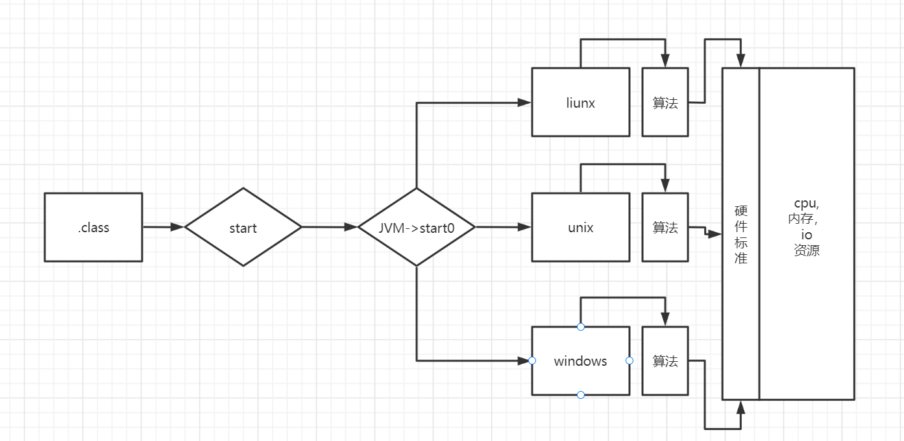
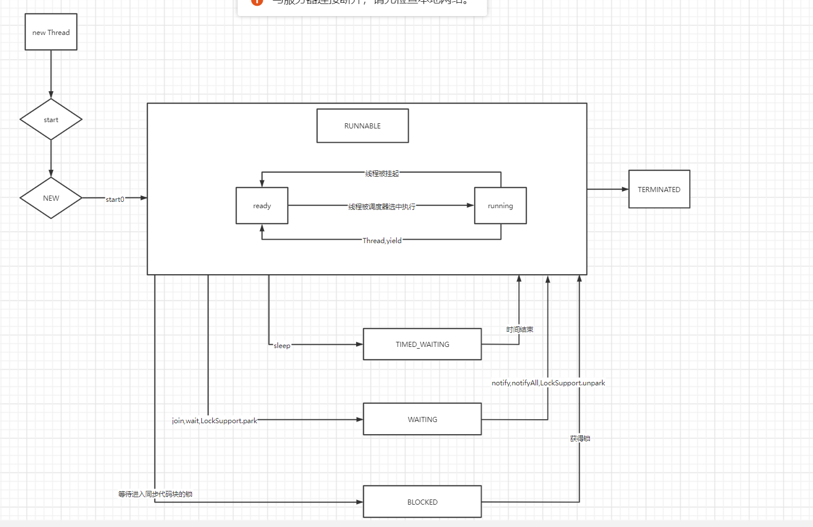

### Java 线程基础知识

> 讲进程（每一个进程都是一个代码程序运行的应用），线程（是进程中再次建立起的一个小分支）是操作系统能够进行运算调度的基本单位。它包含在进程中，是进程中的
> 实际运行单位。

* [进程中包含多个线程，而线程不能包含进程]
* [进程是操作系统分配资源的基本单位，线程是操作系统调度的基本单位]
* [多个进程之间的资源是部共享的，有自己独立的栈，堆，虚存空间，文件描述等；线程是可以共享进程资源文件（堆，方法区）]
* [进程上下文切换慢，线程的上下文切换速度很快]

##### 单线程:（同一个时刻，只允许执行一个线程）
##### 多线程:（同一个时刻，可以执行多个线程）
##### 并发: 同一个时刻，多个任务交替执行（单核cpu会不断的切换任务来完成并发操作）
##### 并行: 同一个时刻，多个任务同时执行（多核cpu中每个cpu独立执行一个任务，多个任务同时执行，不需要切换）

********

##### 创建线程的两种方式



******

* 继承`Thread`类,重写`run`方法

```java
public class CreatedThread {

    public static void main(String[] args) {

        //得到主线程名 main
        System.out.println(Thread.currentThread().getName());
        Cat cat = new Cat();
        //启动线程
        cat.start();
        //主线程不会阻塞，交替执行
        for (int i = 0; i < 10; i++) {
            try {
                System.out.println("main 线程输出：" + i);
                Thread.sleep(1000);
            } catch (InterruptedException e) {
                throw new RuntimeException(e);
            }

        }
    }
}

class Cat extends Thread {

    int times = 0;
    
    @Override
    public void run() {

        while (times <= 8) {
            System.out.println("小猫" + times++);
            //当前线程名 Thread-0
            System.out.println(Thread.currentThread().getName());
            //休眠1秒

            try {
                Thread.sleep(1000);

            } catch (InterruptedException e) {
                throw new RuntimeException(e);
            }
        }

    }
}
```

* 实现`Runnable`接口,重写`run`方法

```java
public class CreateThread2 {

    public static void main(String[] args) {
        Dog dog = new Dog();

        Thread thread = new Thread(dog);

        thread.start();
    }
}

class Dog implements Runnable {

    int num = 0;

    @Override
    public void run() {

        while (num < 10) {
            System.out.println("线程名：" + Thread.currentThread().getName() + " " + num++);

            try {
                Thread.sleep(1000);
            } catch (InterruptedException e) {
                throw new RuntimeException(e);
            }
        }
    }
}
```

* 同时创建多个不同的线程

```java
public class CreateThread3 {

    public static void main(String[] args) {
        Jay jay1 = new Jay(5);
        Jay jay2 = new Jay(10);

        Thread thread1 = new Thread(jay1);
        Thread thread2 = new Thread(jay2);

        thread1.start();
        thread2.start();
    }
}

class Jay implements Runnable {

    public int num = 1;

    public Jay(int num) {
        this.num = num;
    }

    @Override
    public void run() {
        for (int i = 0; i < num; i++) {
            System.out.printf("线程名：%s\n", Thread.currentThread().getName());

            try {
                Thread.sleep(1000);
            } catch (InterruptedException e) {
                throw new RuntimeException(e);
            }
        }
    }
}

```

* 多线程资源竞争,最终导致`ticketNum`减为负数

```java
public class CreateThread4 {

    public static void main(String[] args) {
        SellTicket sellTicket1 = new SellTicket();
        SellTicket sellTicket2 = new SellTicket();
        SellTicket sellTicket3 = new SellTicket();

        sellTicket1.start();
        sellTicket2.start();
        sellTicket3.start();
    }
}

class SellTicket extends Thread {

    private static int ticketNum = 10;

    @Override
    public void run() {
        while (true) {
            if (ticketNum <= 0) {
                System.out.println("ticketNum 已经小于0~" + Thread.currentThread().getName());
                break;
            }

            try {
                Thread.sleep(50);
            } catch (InterruptedException e) {
                throw new RuntimeException(e);
            }

            System.out.printf("线程：%s ticketNum - 1 = %d\n", Thread.currentThread().getName(), (--ticketNum));
        }
    }
}

```

* 线程终止或者退出

```java
public class ThreadExit {

    public static void main(String[] args) throws InterruptedException {

        System.exit(0);
        exit exits = new exit();

        exits.start();

        Thread.sleep(1000);

        //通知退出|或者是线程中run()方法结束
        exit.loop = false;
    }
}

class exit extends Thread {

    public static boolean loop = true;

    @Override
    public void run() {
        while (loop) {

            try {
                Thread.sleep(50);
            } catch (InterruptedException e) {
                throw new RuntimeException(e);
            }

            System.out.println("线程 ：" + Thread.currentThread().getName() + " 在运行~");
        }
    }
}

```

* 线程常用的方法

```java
//得到线程名
//设置线程名
//得到线程的优先级
//设置线程的优先级
//线程休眠
//终端线程休眠
//开启线程

public class ThreadInfo {

    public static void main(String[] args) throws InterruptedException {
        T t = new T("jay-thread-1");
        //设置线程的优先级
        t.setPriority(Thread.MIN_PRIORITY);
        //开启线程
        t.start();

        for (int i = 0; i < 5; i++) {
            Thread.sleep(1000);

            System.out.println("main 线程：" + i);
        }

        t.interrupt();
    }
}

class T extends Thread {

    public String name = "";

    public T(String name) {
        this.name = name;
    }

    // 线程执行的具体逻辑
    @Override
    public void run() {
        System.out.println("未修改的线程名：" + Thread.currentThread().getName());

        Thread.currentThread().setName(name);

        System.out.println("修改后的线程名：" + Thread.currentThread().getName());


        System.out.println("线程的优先级：" +  Thread.currentThread().getPriority());

        while (true) {
            for (int i = 0; i < 100; i++) {
                System.out.println("线程运行：" + i);
            }

            try {
                //线程休眠
                System.out.println("线程休眠中~");
                Thread.sleep(1000 * 20);
            } catch (InterruptedException e) {
                System.out.println("线程被 interrupt 了");
            }
        }
    }
}

```

* 线程礼让|插队`yield|join` **yield**让出cpu，让其它线程执行，但是具有不确定性，**join**插队，A,B线程同时执行，A执行5s之后，`join`让B线程执行完毕，A线程再继续执行

```java
public class ThreadJoin {

    public static void main(String[] args) throws InterruptedException {

        J j = new J();

        j.start();

        for (int i = 1; i <= 30; i++) {

            System.out.println("线程：" + Thread.currentThread().getName() + " " + i);

            Thread.sleep(50);

            if (5 == i) {
                System.out.println("主线程让子线程先执行完毕~");
                //子线程插队
                j.join();
                //主线程礼让
                Thread.yield();
            }
        }
    }
}

class J extends Thread {

    @Override
    public void run() {

        for (int i = 1; i <= 100; i++) {

            System.out.println("线程：" + Thread.currentThread().getName() + " " + i);

            try {
                sleep(50);
            } catch (InterruptedException e) {
                throw new RuntimeException(e);
            }
        }
    }
}
```

* 用户线程（工作线程），线程的任务执行完毕或者是通知方式的结束

* 守护线程 为某些线程服务，当所有的用户线程结束，守护线程自动结束（比如垃圾回收机制）

```java
public class ThreadDaemon {

    public static void main(String[] args) throws InterruptedException {

        Daemon daemon = new Daemon();

        //设置子线程为守护线程，主线程退出之后，子线程也退出
        daemon.setDaemon(true);

        daemon.start();

        for (int i = 1; i <= 10; i++) {

            System.out.println("主线程：" + Thread.currentThread().getName() + " " + i);

            Thread.sleep(1000);
        }
    }
}

class Daemon extends Thread {

    @Override
    public void run() {
        int i = 1;
        for (;;) {
            try {
                sleep(500);
            } catch (InterruptedException e) {
                throw new RuntimeException(e);
            }


            System.out.println("守护线程：" + getName() + " " + i);

            i++;
        }
    }
}
```

* 线程的生命周期,在`public enum State`枚举中，定义了六大常量，代表线程不同的运行状态
    * `NEW` 尚未启动的线程
    * `RUNNABLE` 在java虚拟机中执行的线程
    * `BLOCKED` 被阻塞等待监视器锁定的线程
    * `WAITING` 正在等待另一个线程执行特定动作的线程
    * `TIMED_WAITING` (超时等待)正在等待另一个线程执行动作到达指定等待时间的线程
    * `TERMINATED` 已退出的线程

*********



*********

* 线程同步机制（当有一个线程在对内存操作时，其它线程都不能对这个内存地址操作，直到该线程完成操作，其它线程才可以对该内存地址进行操作）

> **`synchronized`** 当某个对象使用它修饰时，表明该对象在某一个时刻只能由一个线程访问 
> **多个线程竞争的必须是同一把锁**
> 同步静态方法：锁的是类本身
> 同步方法：锁的是this对象（或者是多个线程所得是同一个对象）

```java
public class ThreadLock {
  public static void main(String[] args) {
    Lock lock1 = new Lock();

    new Thread(lock1).start();
    new Thread(lock1).start();
    new Thread(lock1).start();
    new Thread(lock1).start();

  }
}

class Lock implements Runnable {

  private int ticketNum = 20;

  private boolean loop = true;

  private Object o = new Object();

  @Override
  public void run() {
    while (true) {
      if (!loop) {
        break;
      }
//            sell();
//            sell1();
      sell2();
    }
  }

  // 同步代码块 静态方法，锁加在类本身
  public static void sell4() {
    synchronized(Lock.class) {

    }
  }

  //同步方法，静态方法 互斥锁加在 Lock.class
  public synchronized static void sell3() {

  }

  // 同步代码块，互斥锁还是在 o 对象(Object是同一个对象)
  public void sell2() {
    synchronized (o) {
      if (ticketNum <= 0) {
        System.out.println("线程结束 " + Thread.currentThread().getName());
        loop = false;
        return;
      }

      try {
        Thread.sleep(50);
      } catch (InterruptedException e) {
        throw new RuntimeException(e);
      }

      System.out.printf("线程：%s %d - 1 = %d\n", Thread.currentThread().getName(),ticketNum, (--ticketNum));
    }
  }

  // 同步代码块，互斥锁还是在this对象
  public void sell1() {
    synchronized (this) {
      if (ticketNum <= 0) {
        System.out.println("线程结束 " + Thread.currentThread().getName());
        loop = false;
        return;
      }

      try {
        Thread.sleep(50);
      } catch (InterruptedException e) {
        throw new RuntimeException(e);
      }

      System.out.printf("线程：%s %d - 1 = %d\n", Thread.currentThread().getName(),ticketNum, (--ticketNum));
    }
  }

  // 同步方法，这个时候锁在 this 对象
  public synchronized void sell() {
    if (ticketNum <= 0) {
      System.out.println("线程结束 " + Thread.currentThread().getName());
      loop = false;
      return;
    }

    try {
      Thread.sleep(50);
    } catch (InterruptedException e) {
      throw new RuntimeException(e);
    }

    System.out.printf("线程：%s %d - 1 = %d\n", Thread.currentThread().getName(),ticketNum, (--ticketNum));
  }
}
```

* 线程死锁 多个线程都占用了对方的锁资源，但是不肯相让，导致了死锁

* 释放锁 
  * 当前线程的同步方法，同步代码块执行结束
  * 当前线程的同步方法，同步代码块遇到break,return
  * 当前线程的同步方法，同步代码块出现了error,Exception导致异常结束
  * 当前线程的同步方法，同步代码块执行了线程对象的wait方法，当前线程暂停，并释放锁
* 不会释放锁
  * 线程执行同步方法或代码块，程序调用Thread.sleep(),Thread.yield()方法暂停当前线程的执行，不会释放锁
  * 线程执行同步方法或代码块，其它线程调用了该线程的suspend()方法将该线程挂起，该线程不会释放锁
  
* 线程池

```java
import java.util.concurrent.ExecutorService;
import java.util.concurrent.Executors;

public class ThreadPool {

    public static void main(String[] args) {
        //创建一个线程池
        ExecutorService executorService = Executors.newFixedThreadPool(10);

        //执行线程
        executorService.execute(new P1());
        executorService.execute(new P1());
        executorService.execute(new P1());
        executorService.execute(new P1());
        executorService.execute(new P1());
        executorService.execute(new P1());

        //关闭线程池
        executorService.shutdown();
    }
}

class P1 implements Runnable {

    @Override
    public void run() {
        System.out.printf("%s 正在运行~\n", Thread.currentThread().getName());
    }
}
```